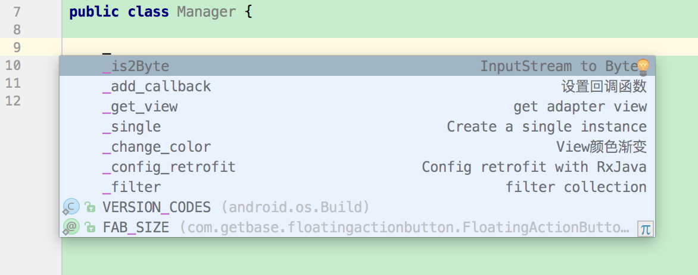
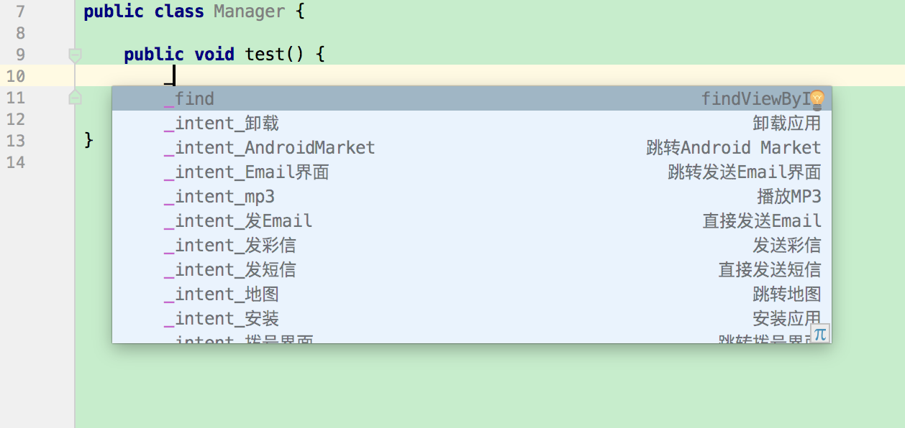
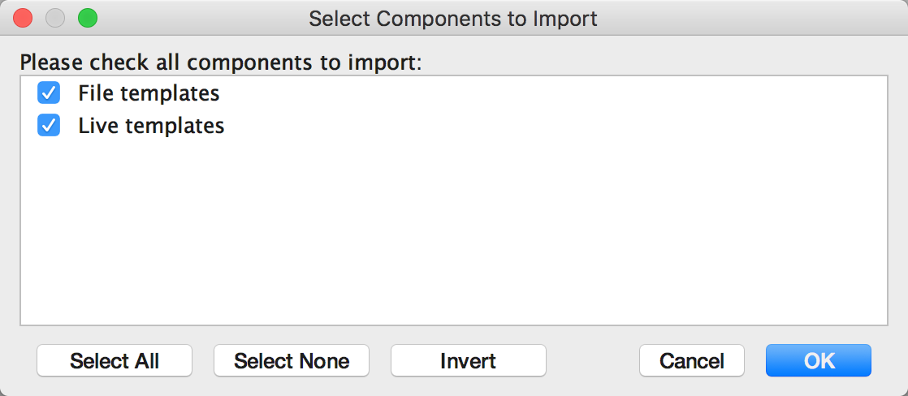
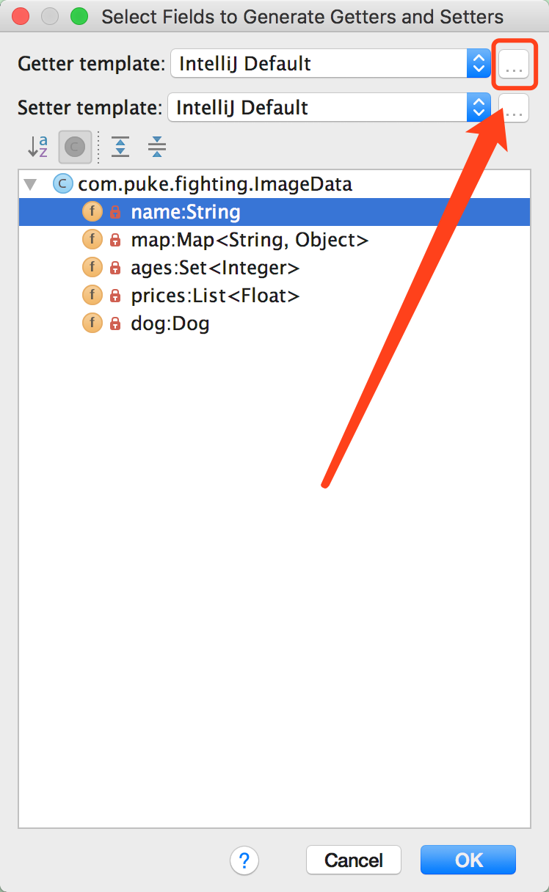
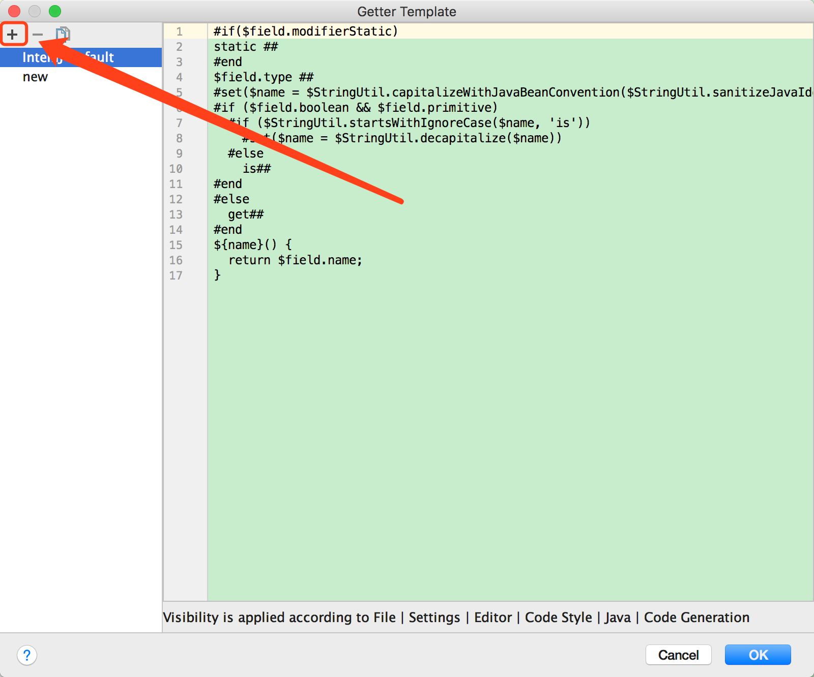
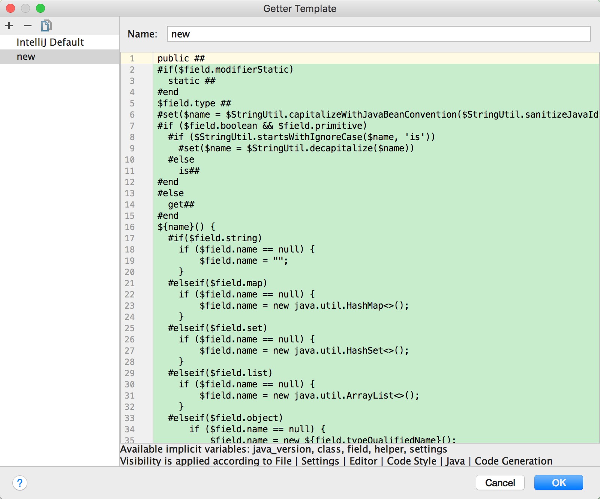

# Android-Studio-Template
> *Android Studio模板集合，收集了比较常用的模板，直接拿去用*
>
> Gif效果：[LiveTemplate](https://puke3615.github.io/2016/10/14/Android-Studio-Template-For-Part/)、[FileTemplate](https://puke3615.github.io/2016/10/15/Android-Studio-Template-For-File/)


## 效果展示






## 快速使用

### 导入LiveTemplate & FileTemplate

* IDE中依次进入`File` - `Import Settings…` 

* 选择当前文件夹的 `settings.jar`文件，选择导入

  


### 导入Getter模板

按照以下步骤，然后替换为`getter.txt`的内容








----

> ##### *以下为使用示例*

----


## Getter

在生成Getter方法时，自动添加代码保护

```java
public class ImageData {

    private String name;
    private Map<String, Object> map;
    private Set<Integer> ages;
    private List<Float> prices;
    private Dog dog;

    public String getName() {
        if (name == null) {
            name = "";
        }
        return name;
    }

    public Map<String, Object> getMap() {
        if (map == null) {
            map = new HashMap<>();
        }
        return map;
    }

    public Set<Integer> getAges() {
        if (ages == null) {
            ages = new HashSet<>();
        }
        return ages;
    }

    public List<Float> getPrices() {
        if (prices == null) {
            prices = new ArrayList<>();
        }
        return prices;
    }

    public Dog getDog() {
        if (dog == null) {
            dog = new Dog();
        }
        return dog;
    }

    private static class Dog {

    }

}
```


## FileTemplate

### ListView Adapter

生成ListView的通用Adapter模板

```java
public abstract class GoodsAdapter<T> extends BaseAdapter {

    protected final List<T> _data;
    protected final Context _context;

    public GoodsAdapter(Context context) {
        this(context, null);
    }

    public GoodsAdapter(Context context, List<T> data) {
        this._data = data == null ? new ArrayList<T>() : data;
        this._context = context;
    }

    @Override
    public int getCount() {
        return _data.size();
    }

    @Override
    public T getItem(int position) {
        return _data.get(position);
    }

    @Override
    public long getItemId(int position) {
        return position;
    }

    public void setData(List<T> data) {
        _data.clear();
        if (data != null && data.size() > 0) {
            _data.addAll(data);
        }
        notifyDataSetChanged();
    }

    public void addData(List<T> data) {
        if (data != null && data.size() > 0) {
            _data.addAll(data);
            notifyDataSetChanged();
        }
    }

    public void clearData() {
        if (_data.size() > 0) {
            _data.clear();
            notifyDataSetChanged();
        }
    }

}
```


### RecyclerView Adapter

```java
public class OrderAdapter extends RecyclerView.Adapter<OrderHolder> {

    @LayoutRes
    private static final int LAYOUT_RES = 0;    // set layout resource here.
    private final List<Float> dataList = new ArrayList<>();

    @Override
    public OrderHolder onCreateViewHolder(ViewGroup parent, int viewType) {
        View view = LayoutInflater.from(parent.getContext()).inflate(LAYOUT_RES, null);
        return new OrderHolder(view);
    }

    @Override
    public void onBindViewHolder(OrderHolder holder, int position) {
        Float data = dataList.get(position);
        // bind data here.
    }

    public void setData(List<Float> newData) {
        dataList.clear();
        if (newData != null) {
            dataList.addAll(newData);
        }
        notifyDataSetChanged();
    }

    protected void addData(List<Float> addedData) {
        addedData = addedData == null ? new ArrayList<Float>() : addedData;
        int start = dataList.size();
        dataList.addAll(addedData);
        notifyItemRangeInserted(start, addedData.size());
    }

    @Override
    public int getItemCount() {
        return dataList.size();
    }
}

class OrderHolder extends RecyclerView.ViewHolder {

    OrderHolder(View itemView) {
        super(itemView);
        // find view here.
    }
}
```


## LiveTemplate

### _single

生成单例

```java
public class Manager {

    private static final byte[] sInstanceLock = new byte[0];
    private static Manager sInstance;

    private Manager() {
    }

    public static Manager instance() {
        if (sInstance == null) {
            synchronized (sInstanceLock) {
                if (sInstance == null) {
                    sInstance = new Manager();
                }
            }
        }
        return sInstance;
    }

}
```


### _add_callback

给当前类生成回调函数

```java
public class Manager {

    private Callback mCallback;

    public void setCallback(Callback callback) {
        this.mCallback = callback;
    }

    public interface Callback {
        void onCall();
    }

}
```


### _change_color

生成颜色渐变逻辑

```java
public class Manager {

    private static void changeColor(final View view, int startColor, int endColor) {
        final int r0 = Color.red(startColor);
        final int g0 = Color.green(startColor);
        final int b0 = Color.blue(startColor);
        final int r1 = Color.red(endColor);
        final int g1 = Color.green(endColor);
        final int b1 = Color.blue(endColor);
        ValueAnimator animator = ValueAnimator.ofFloat(0, 1);
        animator.setDuration(5000);
        animator.addUpdateListener(new ValueAnimator.AnimatorUpdateListener() {
            @Override
            public void onAnimationUpdate(ValueAnimator animation) {
                float rate = (float) animation.getAnimatedValue();
                int r = (int) (r0 + (r1 - r0) * rate);
                int g = (int) (g0 + (g1 - g0) * rate);
                int b = (int) (b0 + (b1 - b0) * rate);
                view.setBackgroundColor(Color.rgb(r, g, b));
            }
        });
        animator.start();
    }

}
```


### _config_retrofit

快速配置Retrofit + RxJava框架

```java
public class Manager {

    /**
     * 1. 添加以下依赖
     * // Retrofit
     * compile 'com.jakewharton.retrofit:retrofit2-rxjava2-adapter:1.0.0'
     * compile 'com.squareup.retrofit2:retrofit:2.1.0'
     * compile 'com.squareup.retrofit2:converter-gson:2.1.0'
     * // RxJava
     * compile 'io.reactivex.rxjava2:rxjava:2.0.6'
     * compile 'io.reactivex.rxjava2:rxandroid:2.0.1'
     *
     * 2. 配置接口
     * public interface DataApi {
     *      @Headers("Accept-Version: 1.0")
     *      @GET("announcements")
     *      Observable<String> getToken();
     *  }
     *
     * 3. 使用接口
     * DataApi api = HttpClient.getApi(DataApi.class);
     * api.getToken().subscribe(...)
     */
    private static final String BASE_URL = "http://10.1.8.152:8080/";
    private static Retrofit sRetrofit;
    static {
        sRetrofit = new Retrofit.Builder()
                .baseUrl(BASE_URL)
                .addCallAdapterFactory(RxJava2CallAdapterFactory.createWithScheduler(Schedulers.io()))
                .addConverterFactory(GsonConverterFactory.create())
                .build();
    }
    public static <T> T getApi(Class<T> apiType) {
        return sRetrofit.create(apiType);
    }

}
```


### _filter

生成容器过滤逻辑

```java
public class Manager {

    public interface Filter<T> {
        boolean accept(T obj);
    }
        
    public static <T> void filter(Collection<T> collection, Filter<T> filter) {
        if (collection == null || filter == null) {
            return;
        }
        Iterator<T> iterator = collection.iterator();
        while (iterator.hasNext()) {
            if (!filter.accept(iterator.next())) {
                iterator.remove();
            }
        }
    }

}
```


### _get_view

生成Adapter中的getView逻辑

```java
public class Manager {

    @SuppressWarnings("unchecked")
    protected static <T extends View> T getView(@NonNull View view, @IdRes int resId) {
        SparseArray<View> sparseArray = (SparseArray<View>) view.getTag();
        View child = null;
        if (sparseArray == null) {
            sparseArray = new SparseArray<>();
            view.setTag(sparseArray);
        } else {
            child = sparseArray.get(resId);
        }
        if (child == null) {
            sparseArray.put(resId, child = view.findViewById(resId));
        }
        return (T) child;
    }

}
```


### _is2Bytes

生成InputStream转化为byte[]逻辑

```java
public class Manager {

    public static byte[] is2Bytes(InputStream inputStream) {
        if (inputStream == null) {
            return null;
        }
        ByteArrayOutputStream outputStream = new ByteArrayOutputStream();
        try {
            byte[] buffer = new byte[4096];
            int index;
            while ((index = inputStream.read(buffer)) != -1) {
                outputStream.write(buffer, 0, index);
            }
        } catch (IOException e) {
            e.printStackTrace();
        } finally {
            try {
                inputStream.close();
            } catch (IOException e) {
                e.printStackTrace();
            }
        }
        return outputStream.toByteArray();
    }

}
```


### Mark Code Block

生成代码概述

```java
public class Manager {

    // <editor-fold defaultstate="collapsed" desc="Just a test.">
    public static void main(String[] args){
        System.out.println("Hello.");
    }
    // </editor-fold>

}
```
